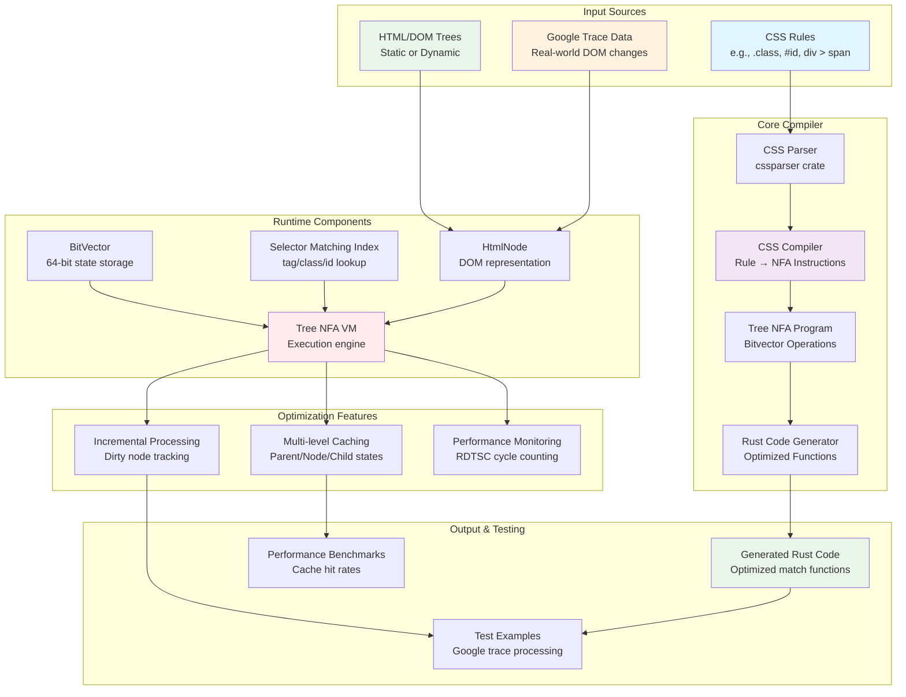

# CSS Bitvector Compiler

```
./run.sh
```


## 🎯 Project Overview

The CSS Bitvector Compiler transforms CSS selectors into efficient bitvector-based matching algorithms, enabling fast incremental DOM tree updates and style recalculation. This project is particularly optimized for handling large-scale web applications like Google's complex DOM structures.

## 🏗️ Architecture



## 📦 Project Structure

```
css-compiler/
├── src/
│   ├── lib.rs          # Core library with all types and functions
│   └── main.rs         # Main executable and Google trace processing
├── examples/
│   └── google_trace_test.rs  # Generated example from real Google data
├── tests/
│   ├── *.html          # Test HTML files
│   └── test.css        # Test CSS rules
├── css-gen-op/         # Google trace processing utilities
│   ├── generate.py     # Trace data processor
│   ├── common.py       # Shared utilities
│   ├── google.trace    # Real Google DOM trace data
│   └── command.json    # Processed DOM change commands
└── target/             # Rust build artifacts
```

## 🔧 Core Components

### 1. **CSS Compiler** (`CssCompiler`)
- Converts CSS rules into NFA instructions
- Manages bitvector bit allocation
- Generates optimized matching programs

### 2. **Tree NFA Program** (`TreeNFAProgram`)
- Stores compiled NFA instructions
- Generates optimized Rust code
- Manages state naming and bit mappings

### 3. **BitVector Operations** (`BitVector`)
- 64-bit efficient state storage
- Bitwise operations for rule matching
- Parent-child state propagation

### 4. **HTML Node Representation** (`HtmlNode`)
- DOM tree structure with CSS matching state
- Incremental update capabilities
- Dirty node tracking and caching

### 5. **Selector Matching Index** (`SelectorMatchingIndex`)
- Fast lookup tables for CSS selectors
- Separate indexes for tags, classes, and IDs
- Parent-dependent rule handling

## 🚀 Key Features

### ⚡ **High Performance**
- **Bitvector Operations**: O(1) rule matching using 64-bit integers
- **RDTSC Timing**: Cycle-accurate performance measurement
- **Optimized Code Generation**: Compile-time specialization

### 🔄 **Incremental Processing**
- **Dirty Node Tracking**: Only recompute changed subtrees
- **Multi-level Caching**: Parent state, node intrinsic, and child state caching
- **Cache Hit Optimization**: Minimize redundant computations

### 🎯 **Real-world Testing**
- **Google Trace Integration**: Process real Chrome DevTools trace data
- **Large-scale DOM Handling**: Tested on complex production websites
- **Performance Benchmarking**: Measure cache hit rates and execution time

## 🛠️ Usage

### Generate Optimized Code
```bash
# Process Google trace data and generate optimized example
cargo run
# This creates examples/google_trace_test.rs

# Run the generated example
cargo run --example google_trace_test
```

### CSS-Gen-Op Utilities
```bash
cd css-gen-op
python3 generate.py google.trace
```

## 🧪 Testing

The project includes comprehensive tests covering:
- CSS parsing and compilation
- Bitvector operations
- Incremental processing
- Cache optimization
- Generated code correctness
- Performance benchmarking

```bash
# Run all tests
cargo test

# Run specific test modules
cargo test test_incremental_processing
cargo test test_performance_comparison
```
