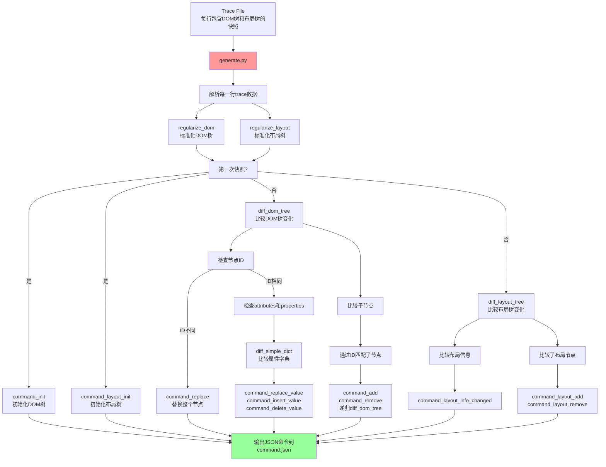

# Usage

```
python3 generate.py google.trace
```

get command.json, record the html change op

---

generate.py && common.py workflow


```mermaid
graph TD
    A[Trace File<br/>每行包含DOM树和布局树的快照] --> B[generate.py]
    B --> C[解析每一行trace数据]
    C --> D[regularize_dom<br/>标准化DOM树]
    C --> E[regularize_layout<br/>标准化布局树]
    
    D --> F[第一次快照?]
    E --> F
    
    F -->|是| G[command_init<br/>初始化DOM树]
    F -->|是| H[command_layout_init<br/>初始化布局树]
    
    F -->|否| I[diff_dom_tree<br/>比较DOM树变化]
    F -->|否| J[diff_layout_tree<br/>比较布局树变化]
    
    I --> K[检查节点ID]
    K -->|ID不同| L[command_replace<br/>替换整个节点]
    K -->|ID相同| M[检查attributes和properties]
    M --> N[diff_simple_dict<br/>比较属性字典]
    N --> O[command_replace_value<br/>command_insert_value<br/>command_delete_value]
    
    I --> P[比较子节点]
    P --> Q[通过ID匹配子节点]
    Q --> R[command_add<br/>command_remove<br/>递归diff_dom_tree]
    
    J --> S[比较布局信息]
    S --> T[command_layout_info_changed]
    J --> U[比较子布局节点]
    U --> V[command_layout_add<br/>command_layout_remove]
    
    G --> W[输出JSON命令到command.json]
    H --> W
    L --> W
    O --> W
    R --> W
    T --> W
    V --> W
    
    style B fill:#ff9999
    style W fill:#99ff99
```
