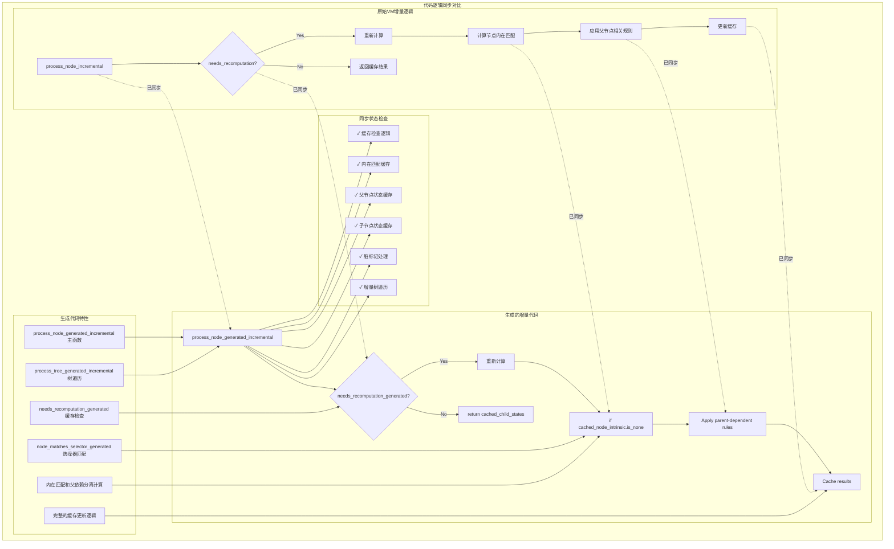

```mermaid
graph TB
    subgraph "代码逻辑同步对比"
        
        subgraph "原始VM增量逻辑"
            VM1[process_node_incremental]
            VM1 --> VMCheck{needs_recomputation?}
            VMCheck -->|Yes| VMCompute[重新计算]
            VMCheck -->|No| VMCached[返回缓存结果]
            VMCompute --> VMIntrinsic[计算节点内在匹配]
            VMIntrinsic --> VMParent[应用父节点相关规则]
            VMParent --> VMCache[更新缓存]
        end
        
        subgraph "生成的增量代码"
            GEN1[process_node_generated_incremental]
            GEN1 --> GENCheck{needs_recomputation_generated?}
            GENCheck -->|Yes| GENCompute[重新计算]
            GENCheck -->|No| GENCached[return cached_child_states]
            GENCompute --> GENIntrinsic[if cached_node_intrinsic.is_none]
            GENIntrinsic --> GENParent[Apply parent-dependent rules]
            GENParent --> GENCache[Cache results]
        end
        
        subgraph "同步状态检查"
            Check1[✓ 缓存检查逻辑]
            Check2[✓ 内在匹配缓存]
            Check3[✓ 父节点状态缓存]
            Check4[✓ 子节点状态缓存]
            Check5[✓ 脏标记处理]
            Check6[✓ 增量树遍历]
        end
        
        VM1 -.->|已同步| GEN1
        VMCheck -.->|已同步| GENCheck
        VMIntrinsic -.->|已同步| GENIntrinsic
        VMParent -.->|已同步| GENParent
        VMCache -.->|已同步| GENCache
        
        GEN1 --> Check1
        GEN1 --> Check2
        GEN1 --> Check3
        GEN1 --> Check4
        GEN1 --> Check5
        GEN1 --> Check6
        
        subgraph "生成代码特性"
            Feature1[process_node_generated_incremental 主函数]
            Feature2[needs_recomputation_generated 缓存检查]
            Feature3[process_tree_generated_incremental 树遍历]
            Feature4[node_matches_selector_generated 选择器匹配]
            Feature5[内在匹配和父依赖分离计算]
            Feature6[完整的缓存更新逻辑]
        end
        
        Feature1 --> GEN1
        Feature2 --> GENCheck
        Feature3 --> GEN1
        Feature4 --> GENIntrinsic
        Feature5 --> GENIntrinsic
        Feature6 --> GENCache
    end
```
