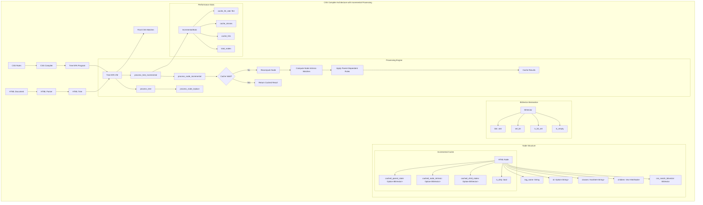

```mermaid
graph TB
    subgraph "CSS Compiler Architecture with Incremental Processing"
        
        CSS[CSS Rules] --> Compiler[CSS Compiler]
        Compiler --> Program[Tree NFA Program]
        
        HTML[HTML Document] --> Parser[HTML Parser]
        Parser --> Tree[HTML Tree]
        
        subgraph "Node Structure"
            Node[HTML Node]
            Node --> TagName[tag_name: String]
            Node --> Id[id: Option&lt;String&gt;]
            Node --> Classes[classes: HashSet&lt;String&gt;]
            Node --> Children[children: Vec&lt;HtmlNode&gt;]
            Node --> MatchBV[css_match_bitvector: BitVector]
            
            subgraph "Incremental Cache"
                Node --> CachedParent[cached_parent_state: Option&lt;BitVector&gt;]
                Node --> CachedIntrinsic[cached_node_intrinsic: Option&lt;BitVector&gt;]
                Node --> CachedChild[cached_child_states: Option&lt;BitVector&gt;]
                Node --> Dirty[is_dirty: bool]
            end
        end
        
        subgraph "Processing Engine"
            VM[Tree NFA VM]
            VM --> Regular[process_tree]
            VM --> Incremental[process_tree_incremental]
            
            Regular --> ProcessNode[process_node_inplace]
            Incremental --> ProcessIncremental[process_node_incremental]
            
            ProcessIncremental --> CheckCache{Cache Valid?}
            CheckCache -->|Yes| ReturnCached[Return Cached Result]
            CheckCache -->|No| Recompute[Recompute Node]
            
            Recompute --> ComputeIntrinsic[Compute Node Intrinsic Matches]
            ComputeIntrinsic --> ApplyParent[Apply Parent-Dependent Rules]
            ApplyParent --> Cache[Cache Results]
        end
        
        subgraph "BitVector Abstraction"
            BV[BitVector]
            BV --> Bits[bits: u64]
            BV --> SetBit[set_bit]
            BV --> IsBitSet[is_bit_set]
            BV --> IsEmpty[is_empty]
        end
        
        Program --> VM
        Tree --> VM
        VM --> Results[Final CSS Matches]
        
        subgraph "Performance Stats"
            Stats[IncrementalStats]
            Stats --> TotalNodes[total_nodes]
            Stats --> CacheHits[cache_hits]
            Stats --> CacheMisses[cache_misses]
            Stats --> HitRate[cache_hit_rate: f64]
        end
        
        Incremental --> Stats
    end
```
